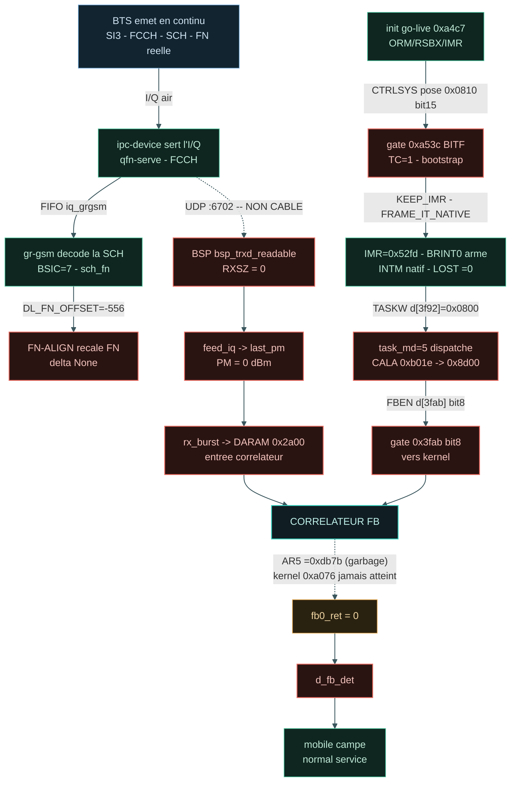

# GRAFCET — go-live DSP & chaîne I/Q

*Auto-généré par `tests/conftest.py::pytest_sessionfinish` — statut dérivé des logs du dernier run (20260930_125905).*

- delta FN-ALIGN : **None**  ·  LOST : **0**

## Rang de blocage · gates

| Rang | Maillon | Gate / wire | État |
|------|---------|-------------|------|
| RANK1 | Pont ARM->DSP d_ctrl_system - gate go-live 0xa53c (bit15 de 0x0810) | `CALYPSO_ARM2DSP_CTRLSYS=1` | `MANQUANT` |
| RANK4 | Recalage FN DSP/TRX sur la SCH - offset constant -556 | `CALYPSO_DL_FN_OFFSET=-556` | `MANQUANT` |
| - | Cadence timer - LOST N! (batching frame-IRQ) | `latch read-driven (-1875/lecture)` | `CABLE` |
| RANK3 | Dispatch handler 0x8d00 -> kernel MAC 0xa076 (AR5=0x2a00) | `TASKW / FBEN (d[3f92], d[3fab] bit8)` | `EN COURS` |
| RANK2 | Entree I/Q DL du BSP - forward producteur -> UDP :6702 | `- (aucun forward)` | `MANQUANT` |
| RANK5 | PM / rxlev legitime (last_pm depuis le vrai I/Q) | `depend de RANK2 (feed_iq)` | `MANQUANT` |

> Convergence au corrélateur : dispatch (go-live) ∧ entrée I/Q (signal). Le verrou courant
> est l'entrée I/Q DL du BSP (`UDP :6702` non câblé) et le dispatch handler→kernel (`AR5`).
