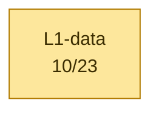

# Calypso test report — 2026-09-30T12:59:06

> Auto-generated by `tests/conftest.py::pytest_sessionfinish`.
> Pasteable directly in a GitHub issue/PR (Mermaid blocks render natively).

## Status global

> [!TIP]
> ✅ **ALL PASS** — 9/23 (39 %)

| métrique | valeur | interprétation |
|---|---:|---|
| pct brut       | 39 % | `passed / total` (inclut xfail+skip — minore) |
| **pct fonctionnel** | **100 %** | `passed / (passed+failed)` — vrai taux des tests qui prétendent valider |
| pct actionnable | 39 % | `(passed+failed) / total` — non-xfailed/non-skipped |

| résultat | nombre |
|---|---:|
| ✅ passed | 9 |
| ❌ failed | 0 |
| ⏭️ skipped | 13 |
| ⚠️ xfailed | 1 |
| **total** | **23** |


## Variables d'environnement du run

Toutes les variables Calypso/pipeline manipulées par `run.sh` (extraites du
script + os.environ). `env` = passée explicitement au lancement ; `default` =
valeur fallback de `run.sh`.

| Variable | Valeur | Source |
|---|---|---|
| `CALYPSO_CONTAINER` | `local` | env |
| `CALYPSO_HOST_ROOT` | `/root` | env |
| `CALYPSO_MOBILE_LOG` | `/tmp/c54x-pont/mobile.log` | env |
| `CALYPSO_MOBILE_VTY` | `4347` | env |
| `CALYPSO_MODE` | `dsp` | env |
| `CALYPSO_MODE_TAG` | `dsp` | env |
| `CALYPSO_MON_SOCK` | `/tmp/qemu-calypso-mon.sock` | env |
| `CALYPSO_OSMOCON_LOG` | `/tmp/c54x-pont/osmocon.log` | env |
| `CALYPSO_QEMU_LOG` | `/tmp/c54x-pont/qemu.log` | env |
| `CALYPSO_SKIP_DIAG_BUNDLE` | `1` | env |
| `CALYPSO_TEST_OUT` | `/root/banc-max-20260930-125627/pytest/couche1` | env |
| `QEMU_TREE` | `/opt/GSM/qosmo` | env |


## Pipeline — où ça casse

Le pipeline ci-dessous trace le flux logique GSM Calypso, étape par étape.
Chaque étape est colorée selon le ratio de tests qui passent. **Si une étape
est rouge (0% pass), c'est le premier blocker** — tout ce qui vient après
ne peut pas être validé tant qu'elle n'est pas verte.




## Blockers

_Aucun test en échec._

## Couches — ce qui marche, ce qui casse

### 🟡 `L1-data` — 10/23
⏭️ **Skipped :** `test_process_couche1`, `test_backend_grgsm_annonce`, `test_synchro_fb_sb`, `test_pont_stats_bursts_descendants`, `test_pont_rach_monte`, `test_immediate_assignment_vu`, `test_canal_dedie_sdcch`, `test_chiffrement_a5_publie_et_confirme`, `test_pas_de_saut_de_frequence_non_gere`, `test_pas_de_release_orphelin`, `test_qemu_sans_crash`, `test_bascule_tch_suit_le_firmware`, `test_parole_descendante_pas_toute_bfi`
⚠️ **xfail :** `test_marge_temps_reel`


## Diagramme détaillé — un graphe par catégorie

Chaque catégorie est rendue dans un graphe séparé pour lisibilité (un seul
gros graphe avec subgraphs imbriqués devient illisible >50 tests). Les
catégories sont indépendantes côté layout — pas de chaîne causale entre
elles dans le détail (voir le pipeline plus haut pour ça).

### 🟡 `Banc` — 10/23

```mermaid
flowchart TB
  classDef pass    fill:#bef5b1,stroke:#1f7a1f,color:#0a3d0a;
  classDef partial fill:#fde79c,stroke:#b07a00,color:#3a2c00;
  classDef fail    fill:#fbb4b4,stroke:#a31a1a,color:#5a0000;
  classDef skip    fill:#e0e0e0,stroke:#6a6a6a,color:#333;
  classDef xfail   fill:#fde79c,stroke:#b07a00,color:#3a2c00;
  C_Banc["Banc<br/>10/23"]
  C_Banc --> T_001_pass_grp_Banc["PASS 9<br/>0.1s"]
  C_Banc --> T_002_test_process_couche1["test_process_couche1<br/>L1-data - banc_couche1<br/>0.00s"]
  C_Banc --> T_003_test_backend_grgsm_annonce["test_backend_grgsm_annonce<br/>L1-data - banc_couche1<br/>0.00s"]
  C_Banc --> T_004_test_synchro_fb_sb["test_synchro_fb_sb<br/>L1-data - banc_couche1<br/>0.00s"]
  C_Banc --> T_005_test_pont_stats_bursts_descendants["test_pont_stats_bursts_descendants<br/>L1-data - banc_couche1<br/>0.00s"]
  C_Banc --> T_006_test_pont_rach_monte["test_pont_rach_monte<br/>L1-data - banc_couche1<br/>0.00s"]
  C_Banc --> T_007_test_immediate_assignment_vu["test_immediate_assignment_vu<br/>L1-data - banc_couche1<br/>0.00s"]
  C_Banc --> T_008_test_canal_dedie_sdcch["test_canal_dedie_sdcch<br/>L1-data - banc_couche1<br/>0.00s"]
  C_Banc --> T_009_test_chiffrement_a5_publie_et_confirme["test_chiffrement_a5_publie_et_confirme<br/>L1-data - banc_couche1<br/>0.00s"]
  C_Banc --> T_010_test_pas_de_saut_de_frequence_non_gere["test_pas_de_saut_de_frequence_non_gere<br/>L1-data - banc_couche1<br/>0.00s"]
  C_Banc --> T_011_test_pas_de_release_orphelin["test_pas_de_release_orphelin<br/>L1-data - banc_couche1<br/>0.00s"]
  C_Banc --> T_012_test_qemu_sans_crash["test_qemu_sans_crash<br/>L1-data - banc_couche1<br/>0.00s"]
  C_Banc --> T_013_test_bascule_tch_suit_le_firmware["test_bascule_tch_suit_le_firmware<br/>L1-data - banc_couche1<br/>0.00s"]
  C_Banc --> T_014_test_parole_descendante_pas_toute_bfi["test_parole_descendante_pas_toute_bfi<br/>L1-data - banc_couche1<br/>0.00s"]
  C_Banc --> T_015_test_marge_temps_reel["test_marge_temps_reel<br/>L1-data - banc_couche1<br/>0.00s"]
  class C_Banc partial;
  class T_001_pass_grp_Banc pass;
  class T_002_test_process_couche1 skip;
  class T_003_test_backend_grgsm_annonce skip;
  class T_004_test_synchro_fb_sb skip;
  class T_005_test_pont_stats_bursts_descendants skip;
  class T_006_test_pont_rach_monte skip;
  class T_007_test_immediate_assignment_vu skip;
  class T_008_test_canal_dedie_sdcch skip;
  class T_009_test_chiffrement_a5_publie_et_confirme skip;
  class T_010_test_pas_de_saut_de_frequence_non_gere skip;
  class T_011_test_pas_de_release_orphelin skip;
  class T_012_test_qemu_sans_crash skip;
  class T_013_test_bascule_tch_suit_le_firmware skip;
  class T_014_test_parole_descendante_pas_toute_bfi skip;
  class T_015_test_marge_temps_reel xfail;
```




## Skipped / xfailed

### 13 skipped
- `test_process_couche1` — banc_couche1,grgsm,skip
- `test_backend_grgsm_annonce` — banc_couche1,grgsm,skip
- `test_synchro_fb_sb` — banc_couche1,grgsm,skip
- `test_pont_stats_bursts_descendants` — banc_couche1,grgsm,skip
- `test_pont_rach_monte` — banc_couche1,grgsm,skip
- `test_immediate_assignment_vu` — banc_couche1,grgsm,skip
- `test_canal_dedie_sdcch` — banc_couche1,grgsm,skip
- `test_chiffrement_a5_publie_et_confirme` — banc_couche1,grgsm,skip
- `test_pas_de_saut_de_frequence_non_gere` — banc_couche1,grgsm,skip
- `test_pas_de_release_orphelin` — banc_couche1,grgsm,skip
- `test_qemu_sans_crash` — banc_couche1,grgsm,skip
- `test_bascule_tch_suit_le_firmware` — banc_couche1,dsp
- `test_parole_descendante_pas_toute_bfi` — banc_couche1,dsp,xfail

### 1 xfailed
- `test_marge_temps_reel` — banc_couche1,dsp,xfail

## Catalogue des tests

Liste exhaustive des tests exécutés ce run, groupés par marker pytest.
Source : nodeids pytest + outcome. Pour chaque test, le statut, la durée
et le fichier source.

### `banc_couche1` — 10/23

| Status | Test | Durée | Fichier |
|---|---|---:|---|
| ✅ passed | `test_api_ram_partagee` | 0.00s | `test_21_couche1_dsp.py` |
| ✅ passed | `test_canal_dedie_suivi` | 0.00s | `test_21_couche1_dsp.py` |
| ✅ passed | `test_chiffrement_a5_dans_le_dsp` | 0.00s | `test_21_couche1_dsp.py` |
| ✅ passed | `test_garde_mvkd_muette` | 0.00s | `test_21_couche1_dsp.py` |
| ⚠️ xfail | `test_marge_temps_reel` | 0.00s | `test_21_couche1_dsp.py` |
| ✅ passed | `test_pas_de_los_en_dedie` | 0.00s | `test_21_couche1_dsp.py` |
| ✅ passed | `test_process_couche1` | 0.05s | `test_21_couche1_dsp.py` |
| ✅ passed | `test_rach_publie` | 0.00s | `test_21_couche1_dsp.py` |
| ✅ passed | `test_sb_plausible` | 0.00s | `test_21_couche1_dsp.py` |
| ✅ passed | `test_tache_fb_postee_et_fb_detecte` | 0.00s | `test_21_couche1_dsp.py` |
| ⏭️ skipped | `test_backend_grgsm_annonce` | 0.00s | `test_20_couche1_grgsm.py` |
| ⏭️ skipped | `test_bascule_tch_suit_le_firmware` | 0.00s | `test_21_couche1_dsp.py` |
| ⏭️ skipped | `test_canal_dedie_sdcch` | 0.00s | `test_20_couche1_grgsm.py` |
| ⏭️ skipped | `test_chiffrement_a5_publie_et_confirme` | 0.00s | `test_20_couche1_grgsm.py` |
| ⏭️ skipped | `test_immediate_assignment_vu` | 0.00s | `test_20_couche1_grgsm.py` |
| ⏭️ skipped | `test_parole_descendante_pas_toute_bfi` | 0.00s | `test_21_couche1_dsp.py` |
| ⏭️ skipped | `test_pas_de_release_orphelin` | 0.00s | `test_20_couche1_grgsm.py` |
| ⏭️ skipped | `test_pas_de_saut_de_frequence_non_gere` | 0.00s | `test_20_couche1_grgsm.py` |
| ⏭️ skipped | `test_pont_rach_monte` | 0.00s | `test_20_couche1_grgsm.py` |
| ⏭️ skipped | `test_pont_stats_bursts_descendants` | 0.00s | `test_20_couche1_grgsm.py` |
| ⏭️ skipped | `test_process_couche1` | 0.00s | `test_20_couche1_grgsm.py` |
| ⏭️ skipped | `test_qemu_sans_crash` | 0.00s | `test_20_couche1_grgsm.py` |
| ⏭️ skipped | `test_synchro_fb_sb` | 0.00s | `test_20_couche1_grgsm.py` |

### `dsp` — 10/12

| Status | Test | Durée | Fichier |
|---|---|---:|---|
| ✅ passed | `test_api_ram_partagee` | 0.00s | `test_21_couche1_dsp.py` |
| ✅ passed | `test_canal_dedie_suivi` | 0.00s | `test_21_couche1_dsp.py` |
| ✅ passed | `test_chiffrement_a5_dans_le_dsp` | 0.00s | `test_21_couche1_dsp.py` |
| ✅ passed | `test_garde_mvkd_muette` | 0.00s | `test_21_couche1_dsp.py` |
| ⚠️ xfail | `test_marge_temps_reel` | 0.00s | `test_21_couche1_dsp.py` |
| ✅ passed | `test_pas_de_los_en_dedie` | 0.00s | `test_21_couche1_dsp.py` |
| ✅ passed | `test_process_couche1` | 0.05s | `test_21_couche1_dsp.py` |
| ✅ passed | `test_rach_publie` | 0.00s | `test_21_couche1_dsp.py` |
| ✅ passed | `test_sb_plausible` | 0.00s | `test_21_couche1_dsp.py` |
| ✅ passed | `test_tache_fb_postee_et_fb_detecte` | 0.00s | `test_21_couche1_dsp.py` |
| ⏭️ skipped | `test_bascule_tch_suit_le_firmware` | 0.00s | `test_21_couche1_dsp.py` |
| ⏭️ skipped | `test_parole_descendante_pas_toute_bfi` | 0.00s | `test_21_couche1_dsp.py` |

### `grgsm` — 0/11

| Status | Test | Durée | Fichier |
|---|---|---:|---|
| ⏭️ skipped | `test_backend_grgsm_annonce` | 0.00s | `test_20_couche1_grgsm.py` |
| ⏭️ skipped | `test_canal_dedie_sdcch` | 0.00s | `test_20_couche1_grgsm.py` |
| ⏭️ skipped | `test_chiffrement_a5_publie_et_confirme` | 0.00s | `test_20_couche1_grgsm.py` |
| ⏭️ skipped | `test_immediate_assignment_vu` | 0.00s | `test_20_couche1_grgsm.py` |
| ⏭️ skipped | `test_pas_de_release_orphelin` | 0.00s | `test_20_couche1_grgsm.py` |
| ⏭️ skipped | `test_pas_de_saut_de_frequence_non_gere` | 0.00s | `test_20_couche1_grgsm.py` |
| ⏭️ skipped | `test_pont_rach_monte` | 0.00s | `test_20_couche1_grgsm.py` |
| ⏭️ skipped | `test_pont_stats_bursts_descendants` | 0.00s | `test_20_couche1_grgsm.py` |
| ⏭️ skipped | `test_process_couche1` | 0.00s | `test_20_couche1_grgsm.py` |
| ⏭️ skipped | `test_qemu_sans_crash` | 0.00s | `test_20_couche1_grgsm.py` |
| ⏭️ skipped | `test_synchro_fb_sb` | 0.00s | `test_20_couche1_grgsm.py` |

### `skip` — 0/11

| Status | Test | Durée | Fichier |
|---|---|---:|---|
| ⏭️ skipped | `test_backend_grgsm_annonce` | 0.00s | `test_20_couche1_grgsm.py` |
| ⏭️ skipped | `test_canal_dedie_sdcch` | 0.00s | `test_20_couche1_grgsm.py` |
| ⏭️ skipped | `test_chiffrement_a5_publie_et_confirme` | 0.00s | `test_20_couche1_grgsm.py` |
| ⏭️ skipped | `test_immediate_assignment_vu` | 0.00s | `test_20_couche1_grgsm.py` |
| ⏭️ skipped | `test_pas_de_release_orphelin` | 0.00s | `test_20_couche1_grgsm.py` |
| ⏭️ skipped | `test_pas_de_saut_de_frequence_non_gere` | 0.00s | `test_20_couche1_grgsm.py` |
| ⏭️ skipped | `test_pont_rach_monte` | 0.00s | `test_20_couche1_grgsm.py` |
| ⏭️ skipped | `test_pont_stats_bursts_descendants` | 0.00s | `test_20_couche1_grgsm.py` |
| ⏭️ skipped | `test_process_couche1` | 0.00s | `test_20_couche1_grgsm.py` |
| ⏭️ skipped | `test_qemu_sans_crash` | 0.00s | `test_20_couche1_grgsm.py` |
| ⏭️ skipped | `test_synchro_fb_sb` | 0.00s | `test_20_couche1_grgsm.py` |

### `xfail` — 1/2

| Status | Test | Durée | Fichier |
|---|---|---:|---|
| ⚠️ xfail | `test_marge_temps_reel` | 0.00s | `test_21_couche1_dsp.py` |
| ⏭️ skipped | `test_parole_descendante_pas_toute_bfi` | 0.00s | `test_21_couche1_dsp.py` |


## Cadence des logs et timers dans le temps

Compte des événements par bucket 10s wall, généré par
`log_timeline.py` sur les logs préfixés `<epoch_sec> +<rel_sec>s` par
`run.sh`. Source : `log_timeline.csv` dans ce dossier. Le plot est produit
côté RStudio/Quarto via le chunk R ci-dessous (no-op en markdown GitHub —
ouvrir le `.qmd` dans RStudio ou lancer `quarto render` pour le rendu).

```{r log-timeline, fig.cap="Cadence logs (sources) + timers (dé-thinned vs nominal GSM)", fig.width=12, fig.height=9, echo=FALSE, message=FALSE, warning=FALSE}
if (!requireNamespace("ggplot2", quietly=TRUE) ||
    !requireNamespace("tidyr",  quietly=TRUE) ||
    !file.exists("log_timeline.csv")) {
  message("ggplot2/tidyr absent OU log_timeline.csv absent dans le dossier de rendu — plot timeline saute (pas d'erreur)")
} else {
  library(ggplot2); library(tidyr)
  df <- read.csv("log_timeline.csv")

  # Plot 1 — log volume per source (events/s)
  src_cols <- c("qemu", "bridge", "osmocon", "mobile")
  p1_data <- pivot_longer(df[, c("t_rel", src_cols)], cols=-t_rel,
                          names_to="source", values_to="events")
  p1_data$rate <- p1_data$events / 10
  p1 <- ggplot(p1_data, aes(t_rel, rate, color=source)) +
    geom_line(linewidth=0.6) + scale_y_log10() +
    labs(title="Cadence brute des logs (events/s)",
         x="t_rel (s)", y="events / s (log scale)") +
    theme_minimal()

  # Plot 2 — timer rates dé-thinned vs nominal GSM
  # tdma & frame_irq loggués 1/1000 ; kick 1/200
  thinning <- c(tdma=1000, frame_irq=1000, kick=200)
  nominal  <- c(tdma=216.7, frame_irq=216.7, kick=200.0)
  tcols <- c("tdma", "frame_irq", "kick")
  p2_data <- pivot_longer(df[, c("t_rel", tcols)], cols=-t_rel,
                          names_to="timer", values_to="events")
  p2_data$rate <- (p2_data$events / 10) *
                  thinning[p2_data$timer]
  nom_df <- data.frame(timer=tcols, nominal=as.numeric(nominal[tcols]))
  p2 <- ggplot(p2_data, aes(t_rel, rate, color=timer)) +
    geom_line(linewidth=0.8) +
    geom_hline(data=nom_df, aes(yintercept=nominal, color=timer),
               linetype="dashed", alpha=0.6) +
    scale_y_log10() +
    labs(title="Timers QEMU : mesurée (lignes) vs nominale (pointillés)",
         subtitle="dé-thinned ×1000 (tdma/frame_irq) ×200 (kick)",
         x="t_rel (s)", y="timer events / s (log scale)") +
    theme_minimal()

  # Plot 3 — DSP signals
  dsp_cols <- c("fb_det_hit", "stack_in_ndb")
  p3_data <- pivot_longer(df[, c("t_rel", dsp_cols)], cols=-t_rel,
                          names_to="signal", values_to="events")
  p3_data$rate <- p3_data$events / 10
  p3 <- ggplot(p3_data, aes(t_rel, rate, color=signal)) +
    geom_line(linewidth=0.6) + scale_y_log10() +
    labs(title="DSP signals (fb-det convergence + stack runaway)",
         x="t_rel (s)", y="events / s (log scale)") +
    theme_minimal()

  # Stack vertical
  if (requireNamespace("patchwork", quietly=TRUE)) {
    library(patchwork); print(p1 / p2 / p3)
  } else {
    print(p1); print(p2); print(p3)
  }
}
```

<details>
<summary>Table brute par bucket 10s — cliquer pour déplier</summary>

```

```

</details>

## Résultats bruts pytest

<details>
<summary>Cliquer pour déplier — sortie verbatim type <code>pytest -v</code></summary>

```
SKIPPED  test_20_couche1_grgsm.py::test_process_couche1 (0.000s)
SKIPPED  test_20_couche1_grgsm.py::test_backend_grgsm_annonce (0.000s)
SKIPPED  test_20_couche1_grgsm.py::test_synchro_fb_sb (0.000s)
SKIPPED  test_20_couche1_grgsm.py::test_pont_stats_bursts_descendants (0.000s)
SKIPPED  test_20_couche1_grgsm.py::test_pont_rach_monte (0.000s)
SKIPPED  test_20_couche1_grgsm.py::test_immediate_assignment_vu (0.000s)
SKIPPED  test_20_couche1_grgsm.py::test_canal_dedie_sdcch (0.000s)
SKIPPED  test_20_couche1_grgsm.py::test_chiffrement_a5_publie_et_confirme (0.000s)
SKIPPED  test_20_couche1_grgsm.py::test_pas_de_saut_de_frequence_non_gere (0.000s)
SKIPPED  test_20_couche1_grgsm.py::test_pas_de_release_orphelin (0.000s)
SKIPPED  test_20_couche1_grgsm.py::test_qemu_sans_crash (0.000s)
PASSED   test_21_couche1_dsp.py::test_process_couche1 (0.049s)
PASSED   test_21_couche1_dsp.py::test_api_ram_partagee (0.000s)
PASSED   test_21_couche1_dsp.py::test_tache_fb_postee_et_fb_detecte (0.001s)
PASSED   test_21_couche1_dsp.py::test_sb_plausible (0.001s)
PASSED   test_21_couche1_dsp.py::test_rach_publie (0.000s)
PASSED   test_21_couche1_dsp.py::test_canal_dedie_suivi (0.001s)
PASSED   test_21_couche1_dsp.py::test_chiffrement_a5_dans_le_dsp (0.001s)
SKIPPED  test_21_couche1_dsp.py::test_bascule_tch_suit_le_firmware (0.000s)
SKIPPED  test_21_couche1_dsp.py::test_parole_descendante_pas_toute_bfi (0.000s)
XFAIL    test_21_couche1_dsp.py::test_marge_temps_reel (0.001s)
PASSED   test_21_couche1_dsp.py::test_garde_mvkd_muette (0.000s)
PASSED   test_21_couche1_dsp.py::test_pas_de_los_en_dedie (0.000s)

============================================================
9 passed, 13 skipped, 1 xfailed in 0.06s
```

</details>

## Plan IrDA debug channel (Phase 2)

Statut auto-détecté depuis l'état du run.

| Phase | Objectif | Statut | Action / notes |
|---|---|---|---|
| **Phase 0** | Reconnaissance UART_IRDA mapped + fw driver | ✅ done | QEMU `calypso_soc.c:231-247`, fw `compal_e88/init.c:105` |
| **Phase 0.5** | Smoke test cons_puts boot marker | 🔧 à faire | ajouter `cons_puts("=== fw-irda boot OK ===\r\n")` après `cons_bind_uart(UART_IRDA)` |
| **Phase 1** | QEMU side mapping chardev → UART_IRDA | ⏸️ caduc | déjà en place via `-serial pty -serial pty` + `serial_hd(1)` |
| **Phase 2** | Firmware side wrapper IrDA | ⏸️ caduc | déjà en place via driver osmocom-bb existant |
| **Phase 3** | Capture host `irda_capture.py` → `/tmp/fw-irda.log` | 🔧 lancer le script | `python3 tools/irda_capture.py /dev/pts/3 &` (auto-lancé par run.sh à terme) |
| **Phase 4** | Tests integration (`test_irda_channel.py`, marker runtime_irda) | 🔧 | 8 tests gradés selon état (boot/produces/throughput/...) |
| **Phase 5** | Instrumentation fw `cons_puts(UART_IRDA, ...)` dans hot path | 🔧 à faire | diagnostiquer le mur `task=24 → DATA_IND=0` — events `EVT_TASK24_*` |
| **Phase 6** | Plot Quarto stacked area des events fw | 🔧 manuel | extension R chunk dans `log_timeline.csv` parser fw-irda events |

_Détection auto basée sur : `/tmp/fw-irda.log` (absent, 0 bytes), `irda_capture.pid` (non), boot marker (absent)._

Réf. `PLAN_CLAUDE_CODE_20260516_IRDA_DEBUG_CHANNEL.md`.

## Chapitre — Blockers détaillés

Pour chaque test en échec : catégorie, couche, marker, message d'assertion,
audit Python dynamique (greps des keywords du message contre tous les logs
container), et stack trace complet dépliable.

_Aucun test en échec — pas de chapitre à générer._


## Annexe — Audit indépendant (`abstract.py`)

Re-compute peer-level produit par `abstract.py` (script racine du repo) à
partir de `results.json` + `log_timeline.csv` du dossier de run. Ne fait pas
confiance au markdown généré — donne une 2ème lecture indépendante des
mêmes données.

<details markdown="1"><summary>Déplier — audit `abstract.py`</summary>

_`abstract.py` introuvable à la racine du repo._


</details>

## Annexe — Diag snapshot (état runtime au moment des tests)

Snapshot rapide produit par `make_diag.sh` au cours de la session pytest.
Pour un bundle complet (tar.gz avec tous les logs filtrés + dumps DSP), utiliser
`./make_diag_bundle.sh`.

<details markdown="1"><summary>Déplier — diag snapshot</summary>

_diag : `make_diag.sh` introuvable à la racine du repo._


</details>

## Annexe — Bundle make_diag_bundle.sh

Bundle généré pendant la session via `make_diag_bundle.sh` (inventaire + digests
texte embarqués). Les logs bruts (qemu_diag, bridge, osmocon, etc.) sont listés
seulement — récupérer le tar.gz pour les contenus complets.

<details markdown="1"><summary>Déplier — bundle make_diag_bundle.sh</summary>

_`make_diag_bundle.sh` introuvable ; ou poser CALYPSO_DIAG_BUNDLE=<tar.gz>._


</details>

## Annexe — Détail complet de tous les tests

<details markdown="1"><summary>Déplier — table complète de tous les tests</summary>

### Banc / L1-data — 10/23

| | Test | Markers | Durée | Erreur / raison (si non-pass) |
|---|---|---|---:|---|
| ✅ | `test_api_ram_partagee` | banc_couche1,dsp | 0.00s |  |
| ✅ | `test_canal_dedie_suivi` | banc_couche1,dsp | 0.00s |  |
| ✅ | `test_chiffrement_a5_dans_le_dsp` | banc_couche1,dsp | 0.00s |  |
| ✅ | `test_garde_mvkd_muette` | banc_couche1,dsp | 0.00s |  |
| ⚠️ | `test_marge_temps_reel` | banc_couche1,dsp,xfail | 0.00s |  |
| ✅ | `test_pas_de_los_en_dedie` | banc_couche1,dsp | 0.00s |  |
| ✅ | `test_process_couche1` | banc_couche1,dsp | 0.05s |  |
| ✅ | `test_rach_publie` | banc_couche1,dsp | 0.00s |  |
| ✅ | `test_sb_plausible` | banc_couche1,dsp | 0.00s |  |
| ✅ | `test_tache_fb_postee_et_fb_detecte` | banc_couche1,dsp | 0.00s |  |
| ⏭️ | `test_backend_grgsm_annonce` | banc_couche1,grgsm,skip | 0.00s | ('/opt/GSM/tests/pytest/test_20_couche1_grgsm.py', 17, 'Skipped: test grgsm : le banc est en mode dsp') |
| ⏭️ | `test_bascule_tch_suit_le_firmware` | banc_couche1,dsp | 0.00s | ('/opt/GSM/tests/pytest/test_21_couche1_dsp.py', 56, 'Skipped: aucun appel dans ce run : pas de bascule TCH a verifier') |
| ⏭️ | `test_canal_dedie_sdcch` | banc_couche1,grgsm,skip | 0.00s | ('/opt/GSM/tests/pytest/test_20_couche1_grgsm.py', 53, 'Skipped: test grgsm : le banc est en mode dsp') |
| ⏭️ | `test_chiffrement_a5_publie_et_confirme` | banc_couche1,grgsm,skip | 0.00s | ('/opt/GSM/tests/pytest/test_20_couche1_grgsm.py', 58, 'Skipped: test grgsm : le banc est en mode dsp') |
| ⏭️ | `test_immediate_assignment_vu` | banc_couche1,grgsm,skip | 0.00s | ('/opt/GSM/tests/pytest/test_20_couche1_grgsm.py', 48, 'Skipped: test grgsm : le banc est en mode dsp') |
| ⏭️ | `test_parole_descendante_pas_toute_bfi` | banc_couche1,dsp,xfail | 0.00s | ('/opt/GSM/tests/pytest/test_21_couche1_dsp.py', 65, 'Skipped: pas de sonde [a_dd] : aucun TCH dans ce run') |
| ⏭️ | `test_pas_de_release_orphelin` | banc_couche1,grgsm,skip | 0.00s | ('/opt/GSM/tests/pytest/test_20_couche1_grgsm.py', 70, 'Skipped: test grgsm : le banc est en mode dsp') |
| ⏭️ | `test_pas_de_saut_de_frequence_non_gere` | banc_couche1,grgsm,skip | 0.00s | ('/opt/GSM/tests/pytest/test_20_couche1_grgsm.py', 65, 'Skipped: test grgsm : le banc est en mode dsp') |
| ⏭️ | `test_pont_rach_monte` | banc_couche1,grgsm,skip | 0.00s | ('/opt/GSM/tests/pytest/test_20_couche1_grgsm.py', 41, 'Skipped: test grgsm : le banc est en mode dsp') |
| ⏭️ | `test_pont_stats_bursts_descendants` | banc_couche1,grgsm,skip | 0.00s | ('/opt/GSM/tests/pytest/test_20_couche1_grgsm.py', 29, 'Skipped: test grgsm : le banc est en mode dsp') |
| ⏭️ | `test_process_couche1` | banc_couche1,grgsm,skip | 0.00s | ('/opt/GSM/tests/pytest/test_20_couche1_grgsm.py', 12, 'Skipped: test grgsm : le banc est en mode dsp') |
| ⏭️ | `test_qemu_sans_crash` | banc_couche1,grgsm,skip | 0.00s | ('/opt/GSM/tests/pytest/test_20_couche1_grgsm.py', 75, 'Skipped: test grgsm : le banc est en mode dsp') |
| ⏭️ | `test_synchro_fb_sb` | banc_couche1,grgsm,skip | 0.00s | ('/opt/GSM/tests/pytest/test_20_couche1_grgsm.py', 22, 'Skipped: test grgsm : le banc est en mode dsp') |

### Tous les nodeids (référence)

<details>
<summary>Cliquer pour déplier — liste exhaustive nodeid → outcome</summary>

```
SKIPPED  test_20_couche1_grgsm.py::test_backend_grgsm_annonce
SKIPPED  test_20_couche1_grgsm.py::test_canal_dedie_sdcch
SKIPPED  test_20_couche1_grgsm.py::test_chiffrement_a5_publie_et_confirme
SKIPPED  test_20_couche1_grgsm.py::test_immediate_assignment_vu
SKIPPED  test_20_couche1_grgsm.py::test_pas_de_release_orphelin
SKIPPED  test_20_couche1_grgsm.py::test_pas_de_saut_de_frequence_non_gere
SKIPPED  test_20_couche1_grgsm.py::test_pont_rach_monte
SKIPPED  test_20_couche1_grgsm.py::test_pont_stats_bursts_descendants
SKIPPED  test_20_couche1_grgsm.py::test_process_couche1
SKIPPED  test_20_couche1_grgsm.py::test_qemu_sans_crash
SKIPPED  test_20_couche1_grgsm.py::test_synchro_fb_sb
PASSED   test_21_couche1_dsp.py::test_api_ram_partagee
SKIPPED  test_21_couche1_dsp.py::test_bascule_tch_suit_le_firmware
PASSED   test_21_couche1_dsp.py::test_canal_dedie_suivi
PASSED   test_21_couche1_dsp.py::test_chiffrement_a5_dans_le_dsp
PASSED   test_21_couche1_dsp.py::test_garde_mvkd_muette
XFAIL    test_21_couche1_dsp.py::test_marge_temps_reel
SKIPPED  test_21_couche1_dsp.py::test_parole_descendante_pas_toute_bfi
PASSED   test_21_couche1_dsp.py::test_pas_de_los_en_dedie
PASSED   test_21_couche1_dsp.py::test_process_couche1
PASSED   test_21_couche1_dsp.py::test_rach_publie
PASSED   test_21_couche1_dsp.py::test_sb_plausible
PASSED   test_21_couche1_dsp.py::test_tache_fb_postee_et_fb_detecte
```

</details>

</details>

## Reproduction

```bash
cd /home/nirvana/qemu-calypso/tests
/tmp/calypso-venv/bin/pytest -v --tb=short
# Filtrer par marker :
/tmp/calypso-venv/bin/pytest -v -m inject_frames
/tmp/calypso-venv/bin/pytest -v -m 'not inject_efficacy'
```

Le diagramme et ce rapport sont régénérés à chaque run et écrits dans
`/root/banc-max-20260930-125627/pytest/couche1/test_results_20260930_125905/test_results.{mmd,md}` (override via `CALYPSO_TEST_OUT`).

---

_Run finished at 2026-09-30T12:59:06._


## Annexe — Report condensé (machine-friendly)

<details markdown="1"><summary>Déplier — report condensé</summary>

> _Rapport condensé (machine-friendly) extrait de `test_results.md`. Pour la version complète : voir le `.md` ou `.qmd` à côté._

## Calypso test report — 2026-09-30T12:59:06

> Auto-generated by `tests/conftest.py::pytest_sessionfinish`.
> Pasteable directly in a GitHub issue/PR (Mermaid blocks render natively).

### Status global

> [!TIP]
> ✅ **ALL PASS** — 9/23 (39 %)

| métrique | valeur | interprétation |
|---|---:|---|
| pct brut       | 39 % | `passed / total` (inclut xfail+skip — minore) |
| **pct fonctionnel** | **100 %** | `passed / (passed+failed)` — vrai taux des tests qui prétendent valider |
| pct actionnable | 39 % | `(passed+failed) / total` — non-xfailed/non-skipped |

| résultat | nombre |
|---|---:|
| ✅ passed | 9 |
| ❌ failed | 0 |
| ⏭️ skipped | 13 |
| ⚠️ xfailed | 1 |
| **total** | **23** |


### Variables d'environnement du run

Toutes les variables Calypso/pipeline manipulées par `run.sh` (extraites du
script + os.environ). `env` = passée explicitement au lancement ; `default` =
valeur fallback de `run.sh`.

| Variable | Valeur | Source |
|---|---|---|
| `CALYPSO_CONTAINER` | `local` | env |
| `CALYPSO_HOST_ROOT` | `/root` | env |
| `CALYPSO_MOBILE_LOG` | `/tmp/c54x-pont/mobile.log` | env |
| `CALYPSO_MOBILE_VTY` | `4347` | env |
| `CALYPSO_MODE` | `dsp` | env |
| `CALYPSO_MODE_TAG` | `dsp` | env |
| `CALYPSO_MON_SOCK` | `/tmp/qemu-calypso-mon.sock` | env |
| `CALYPSO_OSMOCON_LOG` | `/tmp/c54x-pont/osmocon.log` | env |
| `CALYPSO_QEMU_LOG` | `/tmp/c54x-pont/qemu.log` | env |
| `CALYPSO_SKIP_DIAG_BUNDLE` | `1` | env |
| `CALYPSO_TEST_OUT` | `/root/banc-max-20260930-125627/pytest/couche1` | env |
| `QEMU_TREE` | `/opt/GSM/qosmo` | env |


### Pipeline — où ça casse

Le pipeline ci-dessous trace le flux logique GSM Calypso, étape par étape.
Chaque étape est colorée selon le ratio de tests qui passent. **Si une étape
est rouge (0% pass), c'est le premier blocker** — tout ce qui vient après
ne peut pas être validé tant qu'elle n'est pas verte.


### Blockers

_Aucun test en échec._

### Couches — ce qui marche, ce qui casse

#### 🟡 `L1-data` — 10/23
⏭️ **Skipped :** `test_process_couche1`, `test_backend_grgsm_annonce`, `test_synchro_fb_sb`, `test_pont_stats_bursts_descendants`, `test_pont_rach_monte`, `test_immediate_assignment_vu`, `test_canal_dedie_sdcch`, `test_chiffrement_a5_publie_et_confirme`, `test_pas_de_saut_de_frequence_non_gere`, `test_pas_de_release_orphelin`, `test_qemu_sans_crash`, `test_bascule_tch_suit_le_firmware`, `test_parole_descendante_pas_toute_bfi`
⚠️ **xfail :** `test_marge_temps_reel`


### Plan IrDA debug channel (Phase 2)

Statut auto-détecté depuis l'état du run.

| Phase | Objectif | Statut | Action / notes |
|---|---|---|---|
| **Phase 0** | Reconnaissance UART_IRDA mapped + fw driver | ✅ done | QEMU `calypso_soc.c:231-247`, fw `compal_e88/init.c:105` |
| **Phase 0.5** | Smoke test cons_puts boot marker | 🔧 à faire | ajouter `cons_puts("=== fw-irda boot OK ===\r\n")` après `cons_bind_uart(UART_IRDA)` |
| **Phase 1** | QEMU side mapping chardev → UART_IRDA | ⏸️ caduc | déjà en place via `-serial pty -serial pty` + `serial_hd(1)` |
| **Phase 2** | Firmware side wrapper IrDA | ⏸️ caduc | déjà en place via driver osmocom-bb existant |
| **Phase 3** | Capture host `irda_capture.py` → `/tmp/fw-irda.log` | 🔧 lancer le script | `python3 tools/irda_capture.py /dev/pts/3 &` (auto-lancé par run.sh à terme) |
| **Phase 4** | Tests integration (`test_irda_channel.py`, marker runtime_irda) | 🔧 | 8 tests gradés selon état (boot/produces/throughput/...) |
| **Phase 5** | Instrumentation fw `cons_puts(UART_IRDA, ...)` dans hot path | 🔧 à faire | diagnostiquer le mur `task=24 → DATA_IND=0` — events `EVT_TASK24_*` |
| **Phase 6** | Plot Quarto stacked area des events fw | 🔧 manuel | extension R chunk dans `log_timeline.csv` parser fw-irda events |

_Détection auto basée sur : `/tmp/fw-irda.log` (absent, 0 bytes), `irda_capture.pid` (non), boot marker (absent)._

Réf. `PLAN_CLAUDE_CODE_20260516_IRDA_DEBUG_CHANNEL.md`.

### Chapitre — Blockers détaillés

Pour chaque test en échec : catégorie, couche, marker, message d'assertion,
audit Python dynamique (greps des keywords du message contre tous les logs
container), et stack trace complet dépliable.

_Aucun test en échec — pas de chapitre à générer._


### Annexe — Audit indépendant (`abstract.py`)

Re-compute peer-level produit par `abstract.py` (script racine du repo) à
partir de `results.json` + `log_timeline.csv` du dossier de run. Ne fait pas
confiance au markdown généré — donne une 2ème lecture indépendante des
mêmes données.


### Annexe — Diag snapshot (état runtime au moment des tests)

Snapshot rapide produit par `make_diag.sh` au cours de la session pytest.
Pour un bundle complet (tar.gz avec tous les logs filtrés + dumps DSP), utiliser
`./make_diag_bundle.sh`.


</details>
