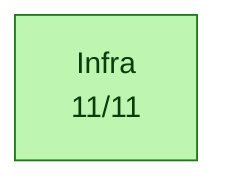
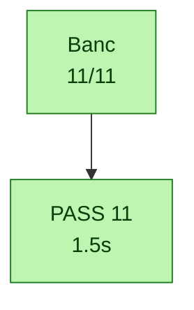

# Calypso test report - 2026-09-30T12:59:04

> Auto-generated by `tests/conftest.py::pytest_sessionfinish`.
> Pasteable directly in a GitHub issue/PR (Mermaid blocks render natively).

## Status global

> [!TIP]
> [OK] **ALL PASS** - 11/11 (100 %)

| metrique | valeur | interpretation |
|---|---:|---|
| pct brut       | 100 % | `passed / total` (inclut xfail+skip - minore) |
| **pct fonctionnel** | **100 %** | `passed / (passed+failed)` - vrai taux des tests qui pretendent valider |
| pct actionnable | 100 % | `(passed+failed) / total` - non-xfailed/non-skipped |

| resultat | nombre |
|---|---:|
| [OK] passed | 11 |
| [X] failed | 0 |
| >> skipped | 0 |
| [!] xfailed | 0 |
| **total** | **11** |


## Variables d'environnement du run

Toutes les variables Calypso/pipeline manipulees par `run.sh` (extraites du
script + os.environ). `env` = passee explicitement au lancement ; `default` =
valeur fallback de `run.sh`.

| Variable | Valeur | Source |
|---|---|---|
| `CALYPSO_CONTAINER` | `local` | env |
| `CALYPSO_HOST_ROOT` | `/root` | env |
| `CALYPSO_MOBILE_LOG` | `/tmp/c54x-pont/mobile.log` | env |
| `CALYPSO_MOBILE_VTY` | `4347` | env |
| `CALYPSO_MODE` | `dsp` | env |
| `CALYPSO_MODE_TAG` | `dsp` | env |
| `CALYPSO_MON_SOCK` | `/tmp/qemu-calypso-mon.sock` | env |
| `CALYPSO_OSMOCON_LOG` | `/tmp/c54x-pont/osmocon.log` | env |
| `CALYPSO_QEMU_LOG` | `/tmp/c54x-pont/qemu.log` | env |
| `CALYPSO_SKIP_DIAG_BUNDLE` | `1` | env |
| `CALYPSO_TEST_OUT` | `/root/banc-max-20260930-125627/pytest/infra` | env |
| `QEMU_TREE` | `/opt/GSM/qosmo` | env |


## Pipeline - ou ca casse

Le pipeline ci-dessous trace le flux logique GSM Calypso, etape par etape.
Chaque etape est coloree selon le ratio de tests qui passent. **Si une etape
est rouge (0% pass), c'est le premier blocker** - tout ce qui vient apres
ne peut pas etre valide tant qu'elle n'est pas verte.



[OK] Pipeline complet jusqu'a `Infra` - pas de rupture detectee dans l'ordre logique.

## Blockers

_Aucun test en echec._

## Couches - ce qui marche, ce qui casse

### [OK] `Infra` - 11/11
Tous les tests passent dans cette couche.


## Diagramme detaille - un graphe par categorie

Chaque categorie est rendue dans un graphe separe pour lisibilite (un seul
gros graphe avec subgraphs imbriques devient illisible >50 tests). Les
categories sont independantes cote layout - pas de chaine causale entre
elles dans le detail (voir le pipeline plus haut pour ca).

### [OK] `Banc` - 11/11




## Skipped / xfailed

_Aucun test skipped ou xfailed._

## Catalogue des tests

Liste exhaustive des tests executes ce run, groupes par marker pytest.
Source : nodeids pytest + outcome. Pour chaque test, le statut, la duree
et le fichier source.

### `banc_infra` - 11/11

| Status | Test | Duree | Fichier |
|---|---|---:|---|
| [OK] passed | `test_asterisk_sip_5060` | 0.03s | `test_10_infra.py` |
| [OK] passed | `test_bts_trx_operationnel` | 1.30s | `test_10_infra.py` |
| [OK] passed | `test_bts_trx_vty` | 0.04s | `test_10_infra.py` |
| [OK] passed | `test_coeur_process_et_vty[osmo-bsc-4242]` | 0.02s | `test_10_infra.py` |
| [OK] passed | `test_coeur_process_et_vty[osmo-hlr-4258]` | 0.02s | `test_10_infra.py` |
| [OK] passed | `test_coeur_process_et_vty[osmo-mgw-4243]` | 0.02s | `test_10_infra.py` |
| [OK] passed | `test_coeur_process_et_vty[osmo-msc-4254]` | 0.02s | `test_10_infra.py` |
| [OK] passed | `test_coeur_process_et_vty[osmo-stp-4239]` | 0.02s | `test_10_infra.py` |
| [OK] passed | `test_proto_smsc_socket` | 0.00s | `test_10_infra.py` |
| [OK] passed | `test_pulse_sinks_gsm` | 0.01s | `test_10_infra.py` |
| [OK] passed | `test_sip_connector_et_mncc` | 0.02s | `test_10_infra.py` |

### `commun` - 11/11

| Status | Test | Duree | Fichier |
|---|---|---:|---|
| [OK] passed | `test_asterisk_sip_5060` | 0.03s | `test_10_infra.py` |
| [OK] passed | `test_bts_trx_operationnel` | 1.30s | `test_10_infra.py` |
| [OK] passed | `test_bts_trx_vty` | 0.04s | `test_10_infra.py` |
| [OK] passed | `test_coeur_process_et_vty[osmo-bsc-4242]` | 0.02s | `test_10_infra.py` |
| [OK] passed | `test_coeur_process_et_vty[osmo-hlr-4258]` | 0.02s | `test_10_infra.py` |
| [OK] passed | `test_coeur_process_et_vty[osmo-mgw-4243]` | 0.02s | `test_10_infra.py` |
| [OK] passed | `test_coeur_process_et_vty[osmo-msc-4254]` | 0.02s | `test_10_infra.py` |
| [OK] passed | `test_coeur_process_et_vty[osmo-stp-4239]` | 0.02s | `test_10_infra.py` |
| [OK] passed | `test_proto_smsc_socket` | 0.00s | `test_10_infra.py` |
| [OK] passed | `test_pulse_sinks_gsm` | 0.01s | `test_10_infra.py` |
| [OK] passed | `test_sip_connector_et_mncc` | 0.02s | `test_10_infra.py` |

### `parametrize` - 5/5

| Status | Test | Duree | Fichier |
|---|---|---:|---|
| [OK] passed | `test_coeur_process_et_vty[osmo-bsc-4242]` | 0.02s | `test_10_infra.py` |
| [OK] passed | `test_coeur_process_et_vty[osmo-hlr-4258]` | 0.02s | `test_10_infra.py` |
| [OK] passed | `test_coeur_process_et_vty[osmo-mgw-4243]` | 0.02s | `test_10_infra.py` |
| [OK] passed | `test_coeur_process_et_vty[osmo-msc-4254]` | 0.02s | `test_10_infra.py` |
| [OK] passed | `test_coeur_process_et_vty[osmo-stp-4239]` | 0.02s | `test_10_infra.py` |


## Cadence des logs et timers dans le temps

Compte des evenements par bucket 10s wall, genere par
`log_timeline.py` sur les logs prefixes `<epoch_sec> +<rel_sec>s` par
`run.sh`. Source : `log_timeline.csv` dans ce dossier. Le plot est produit
cote RStudio/Quarto via le chunk R ci-dessous (no-op en markdown GitHub -
ouvrir le `.qmd` dans RStudio ou lancer `quarto render` pour le rendu).

```{r log-timeline, fig.cap="Cadence logs (sources) + timers (de-thinned vs nominal GSM)", fig.width=12, fig.height=9, echo=FALSE, message=FALSE, warning=FALSE}
if (!requireNamespace("ggplot2", quietly=TRUE) ||
    !requireNamespace("tidyr",  quietly=TRUE) ||
    !file.exists("log_timeline.csv")) {
  message("ggplot2/tidyr absent OU log_timeline.csv absent dans le dossier de rendu - plot timeline saute (pas d'erreur)")
} else {
  library(ggplot2); library(tidyr)
  df <- read.csv("log_timeline.csv")

  # Plot 1 - log volume per source (events/s)
  src_cols <- c("qemu", "bridge", "osmocon", "mobile")
  p1_data <- pivot_longer(df[, c("t_rel", src_cols)], cols=-t_rel,
                          names_to="source", values_to="events")
  p1_data$rate <- p1_data$events / 10
  p1 <- ggplot(p1_data, aes(t_rel, rate, color=source)) +
    geom_line(linewidth=0.6) + scale_y_log10() +
    labs(title="Cadence brute des logs (events/s)",
         x="t_rel (s)", y="events / s (log scale)") +
    theme_minimal()

  # Plot 2 - timer rates de-thinned vs nominal GSM
  # tdma & frame_irq loggues 1/1000 ; kick 1/200
  thinning <- c(tdma=1000, frame_irq=1000, kick=200)
  nominal  <- c(tdma=216.7, frame_irq=216.7, kick=200.0)
  tcols <- c("tdma", "frame_irq", "kick")
  p2_data <- pivot_longer(df[, c("t_rel", tcols)], cols=-t_rel,
                          names_to="timer", values_to="events")
  p2_data$rate <- (p2_data$events / 10) *
                  thinning[p2_data$timer]
  nom_df <- data.frame(timer=tcols, nominal=as.numeric(nominal[tcols]))
  p2 <- ggplot(p2_data, aes(t_rel, rate, color=timer)) +
    geom_line(linewidth=0.8) +
    geom_hline(data=nom_df, aes(yintercept=nominal, color=timer),
               linetype="dashed", alpha=0.6) +
    scale_y_log10() +
    labs(title="Timers QEMU : mesuree (lignes) vs nominale (pointilles)",
         subtitle="de-thinned x1000 (tdma/frame_irq) x200 (kick)",
         x="t_rel (s)", y="timer events / s (log scale)") +
    theme_minimal()

  # Plot 3 - DSP signals
  dsp_cols <- c("fb_det_hit", "stack_in_ndb")
  p3_data <- pivot_longer(df[, c("t_rel", dsp_cols)], cols=-t_rel,
                          names_to="signal", values_to="events")
  p3_data$rate <- p3_data$events / 10
  p3 <- ggplot(p3_data, aes(t_rel, rate, color=signal)) +
    geom_line(linewidth=0.6) + scale_y_log10() +
    labs(title="DSP signals (fb-det convergence + stack runaway)",
         x="t_rel (s)", y="events / s (log scale)") +
    theme_minimal()

  # Stack vertical
  if (requireNamespace("patchwork", quietly=TRUE)) {
    library(patchwork); print(p1 / p2 / p3)
  } else {
    print(p1); print(p2); print(p3)
  }
}
```

<details>
<summary>Table brute par bucket 10s - cliquer pour deplier</summary>

```

```

</details>

## Resultats bruts pytest

<details>
<summary>Cliquer pour deplier - sortie verbatim type <code>pytest -v</code></summary>

```
PASSED   test_10_infra.py::test_coeur_process_et_vty[osmo-hlr-4258] (0.017s)
PASSED   test_10_infra.py::test_coeur_process_et_vty[osmo-stp-4239] (0.018s)
PASSED   test_10_infra.py::test_coeur_process_et_vty[osmo-msc-4254] (0.020s)
PASSED   test_10_infra.py::test_coeur_process_et_vty[osmo-bsc-4242] (0.020s)
PASSED   test_10_infra.py::test_coeur_process_et_vty[osmo-mgw-4243] (0.017s)
PASSED   test_10_infra.py::test_bts_trx_vty (0.035s)
PASSED   test_10_infra.py::test_bts_trx_operationnel (1.301s)
PASSED   test_10_infra.py::test_asterisk_sip_5060 (0.030s)
PASSED   test_10_infra.py::test_sip_connector_et_mncc (0.021s)
PASSED   test_10_infra.py::test_proto_smsc_socket (0.000s)
PASSED   test_10_infra.py::test_pulse_sinks_gsm (0.006s)

============================================================
11 passed in 1.48s
```

</details>

## Plan IrDA debug channel (Phase 2)

Statut auto-detecte depuis l'etat du run.

| Phase | Objectif | Statut | Action / notes |
|---|---|---|---|
| **Phase 0** | Reconnaissance UART_IRDA mapped + fw driver | [OK] done | QEMU `calypso_soc.c:231-247`, fw `compal_e88/init.c:105` |
| **Phase 0.5** | Smoke test cons_puts boot marker |  a faire | ajouter `cons_puts("=== fw-irda boot OK ===\r\n")` apres `cons_bind_uart(UART_IRDA)` |
| **Phase 1** | QEMU side mapping chardev -> UART_IRDA |  caduc | deja en place via `-serial pty -serial pty` + `serial_hd(1)` |
| **Phase 2** | Firmware side wrapper IrDA |  caduc | deja en place via driver osmocom-bb existant |
| **Phase 3** | Capture host `irda_capture.py` -> `/tmp/fw-irda.log` |  lancer le script | `python3 tools/irda_capture.py /dev/pts/3 &` (auto-lance par run.sh a terme) |
| **Phase 4** | Tests integration (`test_irda_channel.py`, marker runtime_irda) |  | 8 tests grades selon etat (boot/produces/throughput/...) |
| **Phase 5** | Instrumentation fw `cons_puts(UART_IRDA, ...)` dans hot path |  a faire | diagnostiquer le mur `task=24 -> DATA_IND=0` - events `EVT_TASK24_*` |
| **Phase 6** | Plot Quarto stacked area des events fw |  manuel | extension R chunk dans `log_timeline.csv` parser fw-irda events |

_Detection auto basee sur : `/tmp/fw-irda.log` (absent, 0 bytes), `irda_capture.pid` (non), boot marker (absent)._

Ref. `PLAN_CLAUDE_CODE_20260516_IRDA_DEBUG_CHANNEL.md`.

## Chapitre - Blockers detailles

Pour chaque test en echec : categorie, couche, marker, message d'assertion,
audit Python dynamique (greps des keywords du message contre tous les logs
container), et stack trace complet depliable.

_Aucun test en echec - pas de chapitre a generer._


## Annexe - Audit independant (`abstract.py`)

Re-compute peer-level produit par `abstract.py` (script racine du repo) a
partir de `results.json` + `log_timeline.csv` du dossier de run. Ne fait pas
confiance au markdown genere - donne une 2eme lecture independante des
memes donnees.

<details markdown="1"><summary>Deplier - audit `abstract.py`</summary>

_`abstract.py` introuvable a la racine du repo._


</details>

## Annexe - Diag snapshot (etat runtime au moment des tests)

Snapshot rapide produit par `make_diag.sh` au cours de la session pytest.
Pour un bundle complet (tar.gz avec tous les logs filtres + dumps DSP), utiliser
`./make_diag_bundle.sh`.

<details markdown="1"><summary>Deplier - diag snapshot</summary>

_diag : `make_diag.sh` introuvable a la racine du repo._


</details>

## Annexe - Bundle make_diag_bundle.sh

Bundle genere pendant la session via `make_diag_bundle.sh` (inventaire + digests
texte embarques). Les logs bruts (qemu_diag, bridge, osmocon, etc.) sont listes
seulement - recuperer le tar.gz pour les contenus complets.

<details markdown="1"><summary>Deplier - bundle make_diag_bundle.sh</summary>

_`make_diag_bundle.sh` introuvable ; ou poser CALYPSO_DIAG_BUNDLE=<tar.gz>._


</details>

## Annexe - Detail complet de tous les tests

<details markdown="1"><summary>Deplier - table complete de tous les tests</summary>

### Banc / Infra - 11/11

| | Test | Markers | Duree | Erreur / raison (si non-pass) |
|---|---|---|---:|---|
| [OK] | `test_asterisk_sip_5060` | banc_infra,commun | 0.03s |  |
| [OK] | `test_bts_trx_operationnel` | banc_infra,commun | 1.30s |  |
| [OK] | `test_bts_trx_vty` | banc_infra,commun | 0.04s |  |
| [OK] | `test_coeur_process_et_vty[osmo-bsc-4242]` | banc_infra,commun,parametrize | 0.02s |  |
| [OK] | `test_coeur_process_et_vty[osmo-hlr-4258]` | banc_infra,commun,parametrize | 0.02s |  |
| [OK] | `test_coeur_process_et_vty[osmo-mgw-4243]` | banc_infra,commun,parametrize | 0.02s |  |
| [OK] | `test_coeur_process_et_vty[osmo-msc-4254]` | banc_infra,commun,parametrize | 0.02s |  |
| [OK] | `test_coeur_process_et_vty[osmo-stp-4239]` | banc_infra,commun,parametrize | 0.02s |  |
| [OK] | `test_proto_smsc_socket` | banc_infra,commun | 0.00s |  |
| [OK] | `test_pulse_sinks_gsm` | banc_infra,commun | 0.01s |  |
| [OK] | `test_sip_connector_et_mncc` | banc_infra,commun | 0.02s |  |

### Tous les nodeids (reference)

<details>
<summary>Cliquer pour deplier - liste exhaustive nodeid -> outcome</summary>

```
PASSED   test_10_infra.py::test_asterisk_sip_5060
PASSED   test_10_infra.py::test_bts_trx_operationnel
PASSED   test_10_infra.py::test_bts_trx_vty
PASSED   test_10_infra.py::test_coeur_process_et_vty[osmo-bsc-4242]
PASSED   test_10_infra.py::test_coeur_process_et_vty[osmo-hlr-4258]
PASSED   test_10_infra.py::test_coeur_process_et_vty[osmo-mgw-4243]
PASSED   test_10_infra.py::test_coeur_process_et_vty[osmo-msc-4254]
PASSED   test_10_infra.py::test_coeur_process_et_vty[osmo-stp-4239]
PASSED   test_10_infra.py::test_proto_smsc_socket
PASSED   test_10_infra.py::test_pulse_sinks_gsm
PASSED   test_10_infra.py::test_sip_connector_et_mncc
```

</details>

</details>

## Reproduction

```bash
cd /home/nirvana/qemu-calypso/tests
/tmp/calypso-venv/bin/pytest -v --tb=short
# Filtrer par marker :
/tmp/calypso-venv/bin/pytest -v -m inject_frames
/tmp/calypso-venv/bin/pytest -v -m 'not inject_efficacy'
```

Le diagramme et ce rapport sont regeneres a chaque run et ecrits dans
`/root/banc-max-20260930-125627/pytest/infra/test_results_20260930_125902/test_results.{mmd,md}` (override via `CALYPSO_TEST_OUT`).

---

_Run finished at 2026-09-30T12:59:04._


## Annexe - Report condense (machine-friendly)

<details markdown="1"><summary>Deplier - report condense</summary>

> _Rapport condense (machine-friendly) extrait de `test_results.md`. Pour la version complete : voir le `.md` ou `.qmd` a cote._

## Calypso test report - 2026-09-30T12:59:04

> Auto-generated by `tests/conftest.py::pytest_sessionfinish`.
> Pasteable directly in a GitHub issue/PR (Mermaid blocks render natively).

### Status global

> [!TIP]
> [OK] **ALL PASS** - 11/11 (100 %)

| metrique | valeur | interpretation |
|---|---:|---|
| pct brut       | 100 % | `passed / total` (inclut xfail+skip - minore) |
| **pct fonctionnel** | **100 %** | `passed / (passed+failed)` - vrai taux des tests qui pretendent valider |
| pct actionnable | 100 % | `(passed+failed) / total` - non-xfailed/non-skipped |

| resultat | nombre |
|---|---:|
| [OK] passed | 11 |
| [X] failed | 0 |
| >> skipped | 0 |
| [!] xfailed | 0 |
| **total** | **11** |


### Variables d'environnement du run

Toutes les variables Calypso/pipeline manipulees par `run.sh` (extraites du
script + os.environ). `env` = passee explicitement au lancement ; `default` =
valeur fallback de `run.sh`.

| Variable | Valeur | Source |
|---|---|---|
| `CALYPSO_CONTAINER` | `local` | env |
| `CALYPSO_HOST_ROOT` | `/root` | env |
| `CALYPSO_MOBILE_LOG` | `/tmp/c54x-pont/mobile.log` | env |
| `CALYPSO_MOBILE_VTY` | `4347` | env |
| `CALYPSO_MODE` | `dsp` | env |
| `CALYPSO_MODE_TAG` | `dsp` | env |
| `CALYPSO_MON_SOCK` | `/tmp/qemu-calypso-mon.sock` | env |
| `CALYPSO_OSMOCON_LOG` | `/tmp/c54x-pont/osmocon.log` | env |
| `CALYPSO_QEMU_LOG` | `/tmp/c54x-pont/qemu.log` | env |
| `CALYPSO_SKIP_DIAG_BUNDLE` | `1` | env |
| `CALYPSO_TEST_OUT` | `/root/banc-max-20260930-125627/pytest/infra` | env |
| `QEMU_TREE` | `/opt/GSM/qosmo` | env |


### Pipeline - ou ca casse

Le pipeline ci-dessous trace le flux logique GSM Calypso, etape par etape.
Chaque etape est coloree selon le ratio de tests qui passent. **Si une etape
est rouge (0% pass), c'est le premier blocker** - tout ce qui vient apres
ne peut pas etre valide tant qu'elle n'est pas verte.


[OK] Pipeline complet jusqu'a `Infra` - pas de rupture detectee dans l'ordre logique.

### Blockers

_Aucun test en echec._

### Couches - ce qui marche, ce qui casse

#### [OK] `Infra` - 11/11
Tous les tests passent dans cette couche.


### Plan IrDA debug channel (Phase 2)

Statut auto-detecte depuis l'etat du run.

| Phase | Objectif | Statut | Action / notes |
|---|---|---|---|
| **Phase 0** | Reconnaissance UART_IRDA mapped + fw driver | [OK] done | QEMU `calypso_soc.c:231-247`, fw `compal_e88/init.c:105` |
| **Phase 0.5** | Smoke test cons_puts boot marker |  a faire | ajouter `cons_puts("=== fw-irda boot OK ===\r\n")` apres `cons_bind_uart(UART_IRDA)` |
| **Phase 1** | QEMU side mapping chardev -> UART_IRDA |  caduc | deja en place via `-serial pty -serial pty` + `serial_hd(1)` |
| **Phase 2** | Firmware side wrapper IrDA |  caduc | deja en place via driver osmocom-bb existant |
| **Phase 3** | Capture host `irda_capture.py` -> `/tmp/fw-irda.log` |  lancer le script | `python3 tools/irda_capture.py /dev/pts/3 &` (auto-lance par run.sh a terme) |
| **Phase 4** | Tests integration (`test_irda_channel.py`, marker runtime_irda) |  | 8 tests grades selon etat (boot/produces/throughput/...) |
| **Phase 5** | Instrumentation fw `cons_puts(UART_IRDA, ...)` dans hot path |  a faire | diagnostiquer le mur `task=24 -> DATA_IND=0` - events `EVT_TASK24_*` |
| **Phase 6** | Plot Quarto stacked area des events fw |  manuel | extension R chunk dans `log_timeline.csv` parser fw-irda events |

_Detection auto basee sur : `/tmp/fw-irda.log` (absent, 0 bytes), `irda_capture.pid` (non), boot marker (absent)._

Ref. `PLAN_CLAUDE_CODE_20260516_IRDA_DEBUG_CHANNEL.md`.

### Chapitre - Blockers detailles

Pour chaque test en echec : categorie, couche, marker, message d'assertion,
audit Python dynamique (greps des keywords du message contre tous les logs
container), et stack trace complet depliable.

_Aucun test en echec - pas de chapitre a generer._


### Annexe - Audit independant (`abstract.py`)

Re-compute peer-level produit par `abstract.py` (script racine du repo) a
partir de `results.json` + `log_timeline.csv` du dossier de run. Ne fait pas
confiance au markdown genere - donne une 2eme lecture independante des
memes donnees.


### Annexe - Diag snapshot (etat runtime au moment des tests)

Snapshot rapide produit par `make_diag.sh` au cours de la session pytest.
Pour un bundle complet (tar.gz avec tous les logs filtres + dumps DSP), utiliser
`./make_diag_bundle.sh`.


</details>
