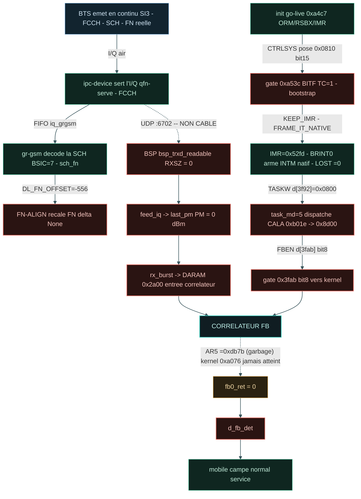

# Synthese go-live

Rapport unifie : etat du go-live DSP (GRAFCET) + resultats de tests + conclusion.

**Progression chemin (ponderee) : 7 %** - FBSB (d_fb_det) 25% + camping 22% = 47% du but ; total etapes atteintes 43 %.

**Progression chemin (ponderee, ordonnee) : 7 %**  
FBSB 25% + camping 22% = 47% du but ; total etapes 43 %  
delta FN None - LOST 0 - 

| Etape | Poids | Etat | Description |
|---|---|---|---|
| E0 | 2% | OK | BTS emet SI3/FCCH/SCH |
| P1 | 2% | OK | ipc-device -> FIFO iq_grgsm |
| G1 | 3% | OK | gr-gsm decode SCH (BSIC=7) |
| F1 | 3% | MUR | FN-ALIGN recale FN |
| B1 | 4% | MUR | BSP :6702 feed_iq |
| B3 | 4% | MUR | rx_burst -> DARAM 0x2a00 |
| A0 | 4% | OK | init go-live (ORM/RSBX/IMR) |
| A1 | 4% | MUR | gate 0x0810 bit15 (abort=0) |
| A2 | 4% | OK | IMR=0x52fd, LOST=0 |
| A3 | 5% | MUR | task_md=5 -> 0x8d00 |
| F2 | 6% | MUR | frame-IT vec28 (PRIO) |
| K | 12% | en cours | CORRELATEUR kernel 0xa076 |
| D | 25% | MUR | FBSB / d_fb_det (fb0_ret>0) |
| M | 22% | OK | mobile campe (normal service) |

# GRAFCET go-live & chaine I/Q

## GRAFCET interprete

# Pipeline & tests detailles

> _Rapport condense (machine-friendly) extrait de `test_results.md`. Pour la version complete : voir le `.md` ou `.qmd` a cote._

# Calypso test report - 2026-09-30T12:59:13

> Auto-generated by `tests/conftest.py::pytest_sessionfinish`.
> Pasteable directly in a GitHub issue/PR (Mermaid blocks render natively).

## Status global

> [!TIP]
> [OK] **ALL PASS** - 10/10 (100 %)

| metrique | valeur | interpretation |
|---|---:|---|
| pct brut       | 100 % | `passed / total` (inclut xfail+skip - minore) |
| **pct fonctionnel** | **100 %** | `passed / (passed+failed)` - vrai taux des tests qui pretendent valider |
| pct actionnable | 100 % | `(passed+failed) / total` - non-xfailed/non-skipped |

| resultat | nombre |
|---|---:|
| [OK] passed | 10 |
| [X] failed | 0 |
| >> skipped | 0 |
| [!] xfailed | 0 |
| **total** | **10** |

## Variables d'environnement du run

Toutes les variables Calypso/pipeline manipulees par `run.sh` (extraites du
script + os.environ). `env` = passee explicitement au lancement ; `default` =
valeur fallback de `run.sh`.

| Variable | Valeur | Source |
|---|---|---|
| `CALYPSO_CONTAINER` | `local` | env |
| `CALYPSO_HOST_ROOT` | `/root` | env |
| `CALYPSO_MOBILE_LOG` | `/tmp/c54x-pont/mobile.log` | env |
| `CALYPSO_MOBILE_VTY` | `4347` | env |
| `CALYPSO_MODE` | `dsp` | env |
| `CALYPSO_MODE_TAG` | `dsp` | env |
| `CALYPSO_MON_SOCK` | `/tmp/qemu-calypso-mon.sock` | env |
| `CALYPSO_OSMOCON_LOG` | `/tmp/c54x-pont/osmocon.log` | env |
| `CALYPSO_QEMU_LOG` | `/tmp/c54x-pont/qemu.log` | env |
| `CALYPSO_SKIP_DIAG_BUNDLE` | `1` | env |
| `CALYPSO_TEST_OUT` | `/root/banc-max-20260930-125627/pytest/mobile` | env |
| `QEMU_TREE` | `/opt/GSM/qosmo` | env |

## Pipeline - ou ca casse

Le pipeline ci-dessous trace le flux logique GSM Calypso, etape par etape.
Chaque etape est coloree selon le ratio de tests qui passent. **Si une etape
est rouge (0% pass), c'est le premier blocker** - tout ce qui vient apres
ne peut pas etre valide tant qu'elle n'est pas verte.

[OK] Pipeline complet jusqu'a `L3-MM` - pas de rupture detectee dans l'ordre logique.

## Blockers

_Aucun test en echec._

## Couches - ce qui marche, ce qui casse

### [OK] `L3-MM` - 10/10
Tous les tests passent dans cette couche.

## Plan IrDA debug channel (Phase 2)

Statut auto-detecte depuis l'etat du run.

| Phase | Objectif | Statut | Action / notes |
|---|---|---|---|
| **Phase 0** | Reconnaissance UART_IRDA mapped + fw driver | [OK] done | QEMU `calypso_soc.c:231-247`, fw `compal_e88/init.c:105` |
| **Phase 0.5** | Smoke test cons_puts boot marker |  a faire | ajouter `cons_puts("=== fw-irda boot OK ===\r\n")` apres `cons_bind_uart(UART_IRDA)` |
| **Phase 1** | QEMU side mapping chardev -> UART_IRDA |  caduc | deja en place via `-serial pty -serial pty` + `serial_hd(1)` |
| **Phase 2** | Firmware side wrapper IrDA |  caduc | deja en place via driver osmocom-bb existant |
| **Phase 3** | Capture host `irda_capture.py` -> `/tmp/fw-irda.log` |  lancer le script | `python3 tools/irda_capture.py /dev/pts/3 &` (auto-lance par run.sh a terme) |
| **Phase 4** | Tests integration (`test_irda_channel.py`, marker runtime_irda) |  | 8 tests grades selon etat (boot/produces/throughput/...) |
| **Phase 5** | Instrumentation fw `cons_puts(UART_IRDA, ...)` dans hot path |  a faire | diagnostiquer le mur `task=24 -> DATA_IND=0` - events `EVT_TASK24_*` |
| **Phase 6** | Plot Quarto stacked area des events fw |  manuel | extension R chunk dans `log_timeline.csv` parser fw-irda events |

_Detection auto basee sur : `/tmp/fw-irda.log` (absent, 0 bytes), `irda_capture.pid` (non), boot marker (absent)._

Ref. `PLAN_CLAUDE_CODE_20260516_IRDA_DEBUG_CHANNEL.md`.

## Chapitre - Blockers detailles

Pour chaque test en echec : categorie, couche, marker, message d'assertion,
audit Python dynamique (greps des keywords du message contre tous les logs
container), et stack trace complet depliable.

_Aucun test en echec - pas de chapitre a generer._

## Annexe - Audit independant (`abstract.py`)

Re-compute peer-level produit par `abstract.py` (script racine du repo) a
partir de `results.json` + `log_timeline.csv` du dossier de run. Ne fait pas
confiance au markdown genere - donne une 2eme lecture independante des
memes donnees.

## Annexe - Diag snapshot (etat runtime au moment des tests)

Snapshot rapide produit par `make_diag.sh` au cours de la session pytest.
Pour un bundle complet (tar.gz avec tous les logs filtres + dumps DSP), utiliser
`./make_diag_bundle.sh`.

# Conclusion

**Ce qui marche :** boot DSP, romload, SIM, go-live (IMR=0x52fd arme), LOST=0, frame-IT servie (vec28 via PRIO), PM MEAS reel.

**Mur actuel (RANK3) :** le kernel FB 0xa076 n'est jamais atteint (AR5 jamais 0x2a00) -> d_fb_det=0 -> pas de camp natif.

**Racine identifiee :** bugs du decodeur C54x de l'emulateur sur les opcodes DU correlateur (branches 0xF8 BC decodees par nibble ; MAC 0x30-0x37 / 0x50-0x59). Fix 4-G pose gate CALYPSO_C54X_FIX_BC ; traceur CORR-FLOW pret.

**Prochain levier :** capturer le chemin du handler 0x8d00 (CALYPSO_CORR_FLOW=1) et corriger le decode de l'instruction qui ecarte le flux de 0xa076.
